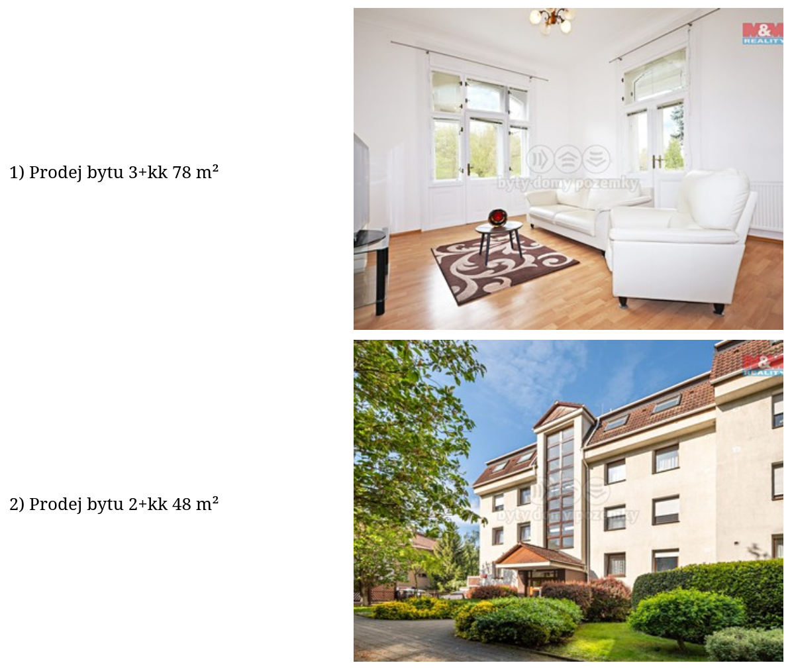

# Luxonis trainee task

## Goal

* This repo aims to solve the trainee task from the Luxonis company.
  The assignment is as follows.

> Use scrapy framework to scrape the first 500 items (title, image url) from sreality.cz (flats, sell) and save it in
> the Postgresql database. Implement a simple HTTP server in python and show these 500 items on a simple page (title and
> image) and put everything to single docker-compose command so that I can just run "docker-compose up" in the Github
> repository and see the scraped ads on http://127.0.0.1:8080 page.

## How to run

1. `docker-compose up`
2. Visit http://127.0.0.1:8080/ to see scraped items

## Solution description

The solution has 3 parts, each a separate docker container.

1. `database`
2. `web`
2. `scraper`

The component `database` is responsible for storing item data.
It is the first component that is started, and all others depend on it.
Component `web` is a simple Flask application that retrieves information from the
`database` and displays them to the user.
Lastly, `scraper` is responsible for filling up the database.
If the database is empty, i.e., no items are stored, `scraper` initiates scraping
and persists the result to the `database.` If there are already some items stored,
`scraper` does nothing.

## Result example

